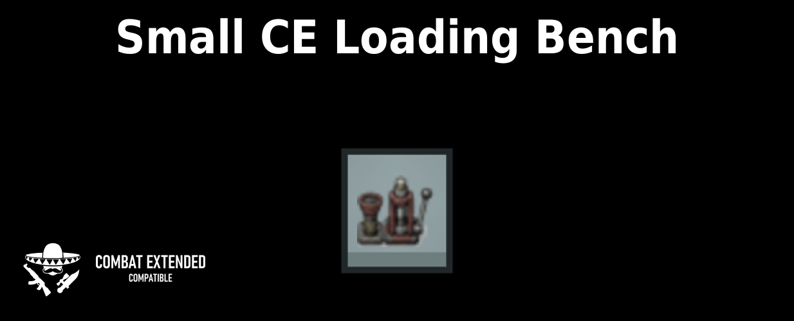

# Small CE Loading Bench



Small CE Loading Bench is a RimWorld 1.6 compatibility mod that reduces Combat
Extended's loading bench from a 3x1 footprint to a compact 1x1 workstation. It
patches the existing bench rather than adding a replacement, so its normal
recipes, bills, research requirement, and work-giver integration remain intact.

## Features

- Reduces Combat Extended's existing loading bench from 3x1 to 1x1.
- Preserves the original Def identity, recipes, bills, costs, research, and
  related mod references.
- Allows placement rotation to move the interaction spot to any side while the
  fixed-perspective graphic remains visually consistent.
- Uses RimWorld's normal stuff-color system, including the steel appearance
  shown in the preview.
- Uses a declarative XML patch with no C# or Harmony runtime dependency.

## Requirements

- RimWorld 1.6
- [Combat Extended](https://steamcommunity.com/sharedfiles/filedetails/?id=2890901044)

The mod metadata declares Combat Extended as required and loads Small CE Loading
Bench after it. RimWorld's automatic mod sorting should establish the correct
order.

## Installation

Download the versioned ZIP from
[GitHub Releases](https://github.com/sanicek/rw-small-ce-loading-bench/releases).
Extract its `SmallCELoadingBench` directory into RimWorld's `Mods` directory,
then enable it in the mod manager. The attached ZIP is the supported manual
download; GitHub's automatically generated source archives are not installable
RimWorld mod packages.

## Compatibility

Existing Combat Extended loading benches become one-cell buildings while this
mod is enabled. Their Def identity is unchanged, so existing bills and recipes
remain attached.

Mods that also patch Combat Extended's `AmmoBench` footprint, graphic class,
texture, draw size, or rotation behavior may conflict. Mods that only add or
alter recipes should generally continue to use the same bench identity.

## Problems and Logs

Reports are welcome through
[GitHub Issues](https://github.com/sanicek/rw-small-ce-loading-bench/issues).
Include the RimWorld, Combat Extended, and Small CE Loading Bench versions; a
short reproduction sequence; the active mod list and load order; and a link to
the relevant `Player.log`. Upload the log to a paste or file-sharing service
rather than pasting the complete file into an issue.

## Building and Local Installation

An XML-only build requires Bash and Python 3.11 or newer:

```bash
./scripts/test.sh
./scripts/build.sh
./scripts/install-local.sh
```

`install-local.sh` defaults to
`~/.local/share/Steam/steamapps/common/RimWorld`. Set `RIMWORLD_DIR` to target a
different installation. It stages and validates the replacement before moving
the current installed mod and restores the prior directory if installation
fails.

The optional C# scaffold is inactive and excluded from packages. Follow
[`scaffolds/csharp/README.md`](scaffolds/csharp/README.md) only if a future,
explicitly approved feature cannot remain declarative.

## Maintainer Documentation

- [Design and compatibility contracts](docs/DESIGN.md)
- [Release policy and records](docs/RELEASES.md)
- [Artwork provenance and approval](artwork/README.md)
- [Repository workflow](AGENTS.md)

`About/About.xml` is the single source for the release version. The build copies
only allowlisted runtime content into `artifacts/`, and every release is packaged
deterministically, installed from its checksum-verified ZIP, and smoke-tested
before publication. Repository-only documentation changes do not require a mod
version increment when package output remains unchanged.

## Artwork, License, and AI Assistance

Small CE Loading Bench's original code and artwork are available under the
[MIT License](LICENSE). The preview incorporates Combat Extended's official
third-party compatibility badge from the
[CE media pack](https://github.com/CombatExtended-Continued/CombatExtended/tree/Development/Media),
which remains under
[CC BY-NC-SA 4.0](https://creativecommons.org/licenses/by-nc-sa/4.0/). See the
[third-party notice](THIRD_PARTY_NOTICES.md) for its pinned source and the
compositing performed for the preview.

Parts of the code, documentation, artwork, and maintenance used AI-tool
assistance. Published changes are reviewed and tested by the maintainer.
